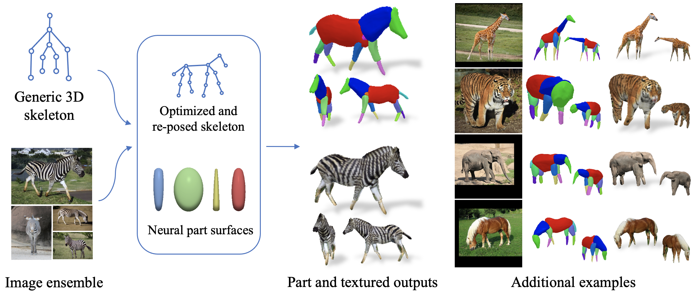

This is not an officially supported Google product.

# LASSIE: Learning Articulated Shapes from Sparse Image Ensemble via 3D Part Discovery (NeurIPS 2022)
### [Project Page](https://chhankyao.github.io/lassie/) | [Video](https://youtu.be/MhQaHzC4Sn0) | [Paper](https://arxiv.org/abs/2207.03434)

Implementation for LASSIE. A novel method which estimates camera pose, 3D articulation, and part shapes of animal bodies given sparse images in-the-wild.

[Chun-Han Yao](http://people.csail.mit.edu/yzli/)<sup>2</sup>, [Wei-Chih Hung](https://hfslyc.github.io/)<sup>2</sup>, [Yuanzhen Li](http://people.csail.mit.edu/yzli/)<sup>2</sup>, [Michael Rubinstein](http://people.csail.mit.edu/mrub/)<sup>2</sup>, [Ming-Hsuan Yang](http://faculty.ucmerced.edu/mhyang/)<sup>2</sup><br>, [Varun Jampani](https://varunjampani.github.io)<sup>2</sup><br>
<sup>1</sup>UC Merced, <sup>2</sup>Waymo, <sup>2</sup>Google Research, <sup>2</sup>Yonsei University




## Setup

A python virtual environment is used for dependency management. The code is tested with Python 3.7, PyTorch 1.11.0, CUDA 11.3. To install other required packages, run:

```
pip install -r requirements.txt
```


## Preparing data and pre-trained model

### Pascal-part
* Download Pascal images [here](http://host.robots.ox.ac.uk/pascal/VOC/voc2010/#devkit) and place them in `data/pascal_part/JPEGImages/`.
* Download Pascal-part annotations [here](http://roozbehm.info/pascal-parts/pascal-parts.html) and place them in `data/pascal_part/Annotations_Part/`.
* Download Pascal-part image sets [here](https://www.dropbox.com/s/u39ygf9jhsg46ld/pascal-part.zip?dl=0) and place them in `data/pascal_part/image-sets/`.

### Our image ensembles (web images)
* Download images [here](https://www.dropbox.com/s/0stdv9pawrz19rb/images.zip?dl=0) and place them in `data/web_images/images/`.
* Download keypoint annotations [here](https://www.dropbox.com/s/s5ic5nc6ac5kqe1/annotations.zip?dl=0) and place them in `data/web_images/annotations/`.

### Pre-trained primitive part decoder
* Download pre-trained model [here](https://www.dropbox.com/s/zmgst92vyikpikf/primitive_decoder.pth?dl=0) and place it in `model_dump/`.


## LASSIE optimization

To run LASSIE optimization on sparse images of an animal class (e.g. zebra), simply run:

```
python train.py --cls zebra
```

The qualitative results can be found in `results/zebra/`. The optimization settings and initial 3D skeleton can be changed in `main/config.py` and `main/skeleton.py`, respectively.


## Evaluation

Once optimization is completed, quantitative evaluation can be done by running:

```
python eval.py --cls zebra
```

The results will be stored in `results/eval/zebra.txt`.


## Citation

```
@inproceedings{yao2022-lassie,
  title         = {{LASSIE}: {L}earning {A}rticulated {S}hape from {S}parse {I}mage {E}nsemble via 3D Part Discovery},
  author        = {Yao, Chun-Han and Hung, Wei-Chih and Li, Yuanzhen and Rubinstein, Michael and Yang, Ming-Hsuan and Jampani, Varun},
  booktitle     = {Advances in Neural Information Processing Systems (NeurIPS)},
  year          = {2022},
}
```
